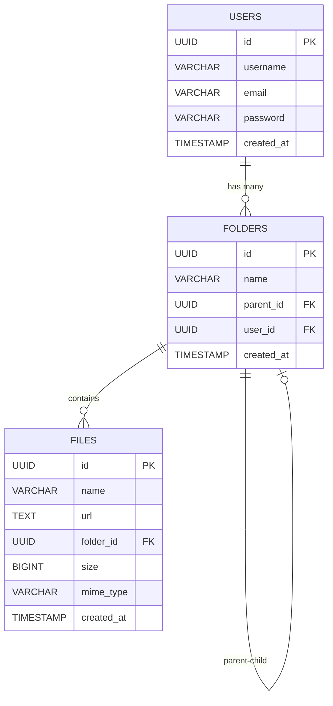

# Database E-R diagram

```mermaid
erDiagram
    USERS {
        UUID id PK
        VARCHAR username
        VARCHAR email
        VARCHAR password
        TIMESTAMP created_at
    }

    FOLDERS {
        UUID id PK
        VARCHAR name
        UUID parent_id FK
        UUID user_id FK
        TIMESTAMP created_at
    }

    FILES {
        UUID id PK
        VARCHAR name
        TEXT url
        UUID folder_id FK
        BIGINT size
        VARCHAR mime_type
        TIMESTAMP created_at
    }

    USERS ||--o{ FOLDERS : "has many"
    FOLDERS ||--o{ FILES : "contains"
    FOLDERS ||--o| FOLDERS : "parent-child"
```
